# Architecture: Module Dependencies

このドキュメントでは、Copy for Scrapbox 拡張機能のモジュール・パッケージ間の依存関係を図示し、各依存関係について詳しく解説します。

## 概要

Copy for Scrapbox は、レイヤードアーキテクチャを採用しており、明確な依存関係の方向性を持っています。各レイヤーは上位レイヤーのみに依存し、循環依存を避けています。

**依存関係の基本原則:**
- 上位レイヤーは下位レイヤーに依存できる
- 下位レイヤーは上位レイヤーに依存してはならない
- 同一レイヤー内のモジュールは相互に依存できる（循環依存を避ける）

---

## アーキテクチャ全体図

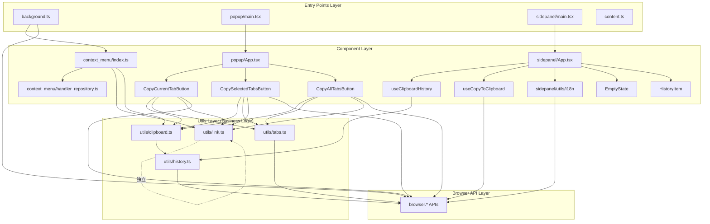

---

## レイヤー構成

### 1. Browser API Layer（最下層）

**説明:** Chrome/Firefox の拡張機能 API を提供する層。`browser.*` グローバルオブジェクトを通じてアクセスされます。

**主要 API:**
- `browser.tabs.*` - タブ情報の取得・操作
- `browser.storage.local.*` - ローカルストレージ
- `browser.contextMenus.*` - コンテキストメニュー
- `browser.scripting.*` - スクリプト実行
- `browser.i18n.*` - 国際化メッセージ
- `browser.sidePanel.*` - サイドパネル制御

**依存関係:** なし（システム提供）

---

### 2. Utils Layer（ビジネスロジック層）

**説明:** ブラウザ API をラップし、ビジネスロジックを提供する純粋な TypeScript モジュール群。UI から独立しており、テストが容易です。

#### 2-1. `utils/link.ts` ⭐ コア

**役割:** Scrapbox 形式のリンクを生成する

**依存関係:**
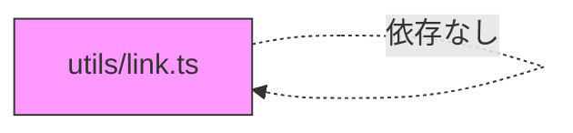

**エクスポート関数:**
- `createLinkForTab(tab: Browser.tabs.Tab): Promise<string>`
  - 単一タブから `[URL Title]` 形式のリンクを生成
  - タイトルから `[]` と `` ` `` を除去（Scrapbox 構文との競合を防ぐ）
- `createLinksForTabs(tabs: Browser.tabs.Tab[]): Promise<string>`
  - 複数タブから箇条書きリストを生成
  - 各行の先頭にスペースを追加

**特徴:**
- **完全に独立** - 他のモジュールに依存しない純粋関数
- **テスト容易性** - モック不要でテスト可能
- **再利用性** - popup, context menu の両方から利用

**使用箇所:**
- `popup/components/CopyCurrentTabButton.tsx`
- `popup/components/CopySelectedTabsButton.tsx`
- `popup/components/CopyAllTabsButton.tsx`
- `context_menu/index.ts`

---

#### 2-2. `utils/tabs.ts`

**役割:** タブクエリのヘルパー関数を提供

**依存関係:**
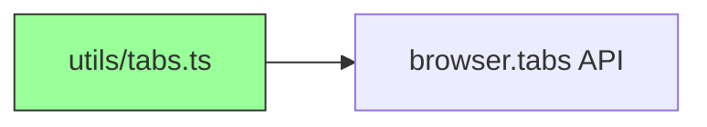

**エクスポート関数:**
- `getCurrentTab()` - アクティブタブを取得
- `getSelectedTabs()` - 選択中のタブを取得
- `getAllTabsOnCurrentWindow()` - 現在のウィンドウの全タブを取得
- `findTabs(queryOption)` - カスタムクエリでタブを検索

**依存先:**
- `browser.tabs.query()` - タブ情報の取得

**使用箇所:**
- `popup/components/CopyCurrentTabButton.tsx`
- `popup/components/CopySelectedTabsButton.tsx`
- `popup/components/CopyAllTabsButton.tsx`

---

#### 2-3. `utils/clipboard.ts`

**役割:** クリップボード操作とヒストリー記録を統合

**依存関係:**
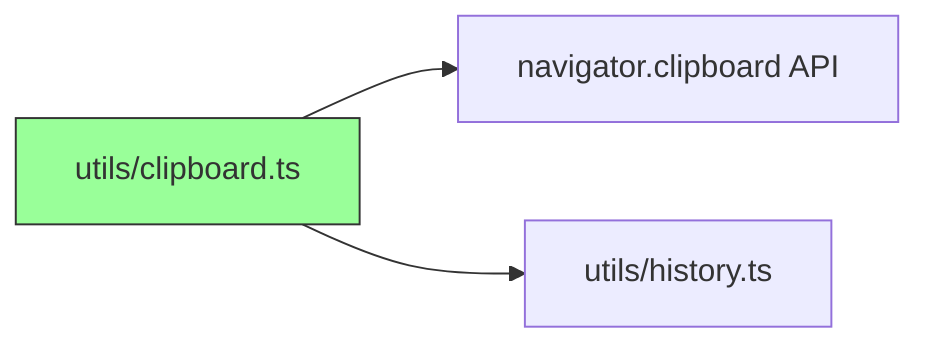

**エクスポート関数:**
- `writeTextToClipboard(text: string): Promise<void>`
  - クリップボードにテキストを書き込む
  - **自動的にヒストリーに追加**

**依存先:**
- `navigator.clipboard.writeText()` - クリップボード書き込み
- `utils/history.ts:addToHistory()` - ヒストリー追加

**重要な実装詳細:**
- コンテキストメニューから呼ばれる際は `browser.scripting.executeScript()` でページコンテキストに注入される
- バックグラウンドスクリプトから直接クリップボードにアクセスできないための対策

**使用箇所:**
- `popup/components/*Button.tsx` - 全てのコピーボタン
- `context_menu/index.ts` - スクリプト注入経由で使用
- `sidepanel/hooks/useCopyToClipboard.ts` - ヒストリー再コピー時は直接 `navigator.clipboard` を使用

---

#### 2-4. `utils/history.ts`

**役割:** クリップボードヒストリーの永続化

**依存関係:**
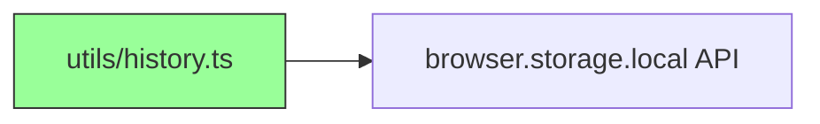

**エクスポート:**
- **型定義:** `ClipboardHistoryItem`
  ```typescript
  interface ClipboardHistoryItem {
    id: string;        // UUID
    text: string;      // コピーされたテキスト
    timestamp: number; // Unix タイムスタンプ
  }
  ```
- **関数:**
  - `getHistory(): Promise<ClipboardHistoryItem[]>` - 全ヒストリー取得
  - `addToHistory(text: string): Promise<void>` - 新規アイテム追加

**依存先:**
- `browser.storage.local` - ローカルストレージ
- `crypto.randomUUID()` - ID 生成

**ストレージ仕様:**
- キー: `'clipboardHistory'`
- 最大保存数: 100 アイテム（FIFO）
- 並び順: 新しいものが先頭

**使用箇所:**
- `utils/clipboard.ts` - 書き込み時に自動追加
- `sidepanel/hooks/useClipboardHistory.ts` - 読み取り＆監視

---

### 3. Component Layer（UI コンポーネント層）

#### 3-1. Popup コンポーネント

##### `popup/main.tsx` (エントリポイント)

**役割:** React アプリケーションのマウント

**依存関係:**
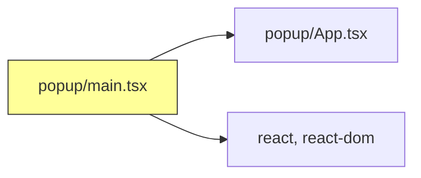

**依存先:**
- `react-dom/client` - React 19 の createRoot
- `popup/App.tsx` - ルートコンポーネント
- `popup.css` - スタイルシート

---

##### `popup/App.tsx`

**役割:** ポップアップの UI 構成とメッセージ表示

**依存関係:**
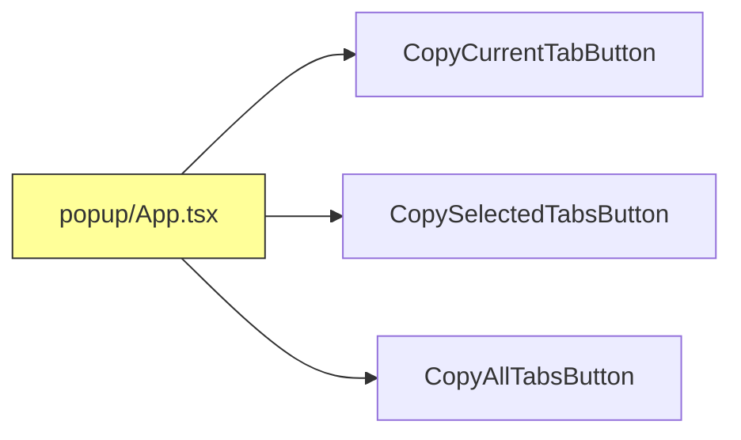

**依存先:**
- `CopyCurrentTabButton` - 現在のタブをコピー
- `CopySelectedTabsButton` - 選択中のタブをコピー
- `CopyAllTabsButton` - 全タブをコピー

**提供機能:**
- `onCopied` コールバックを各ボタンに渡す
- コピー完了メッセージを配列で管理・表示

---

##### `popup/components/CopyCurrentTabButton.tsx`

**役割:** 現在のタブをコピーするボタン

**依存関係:**
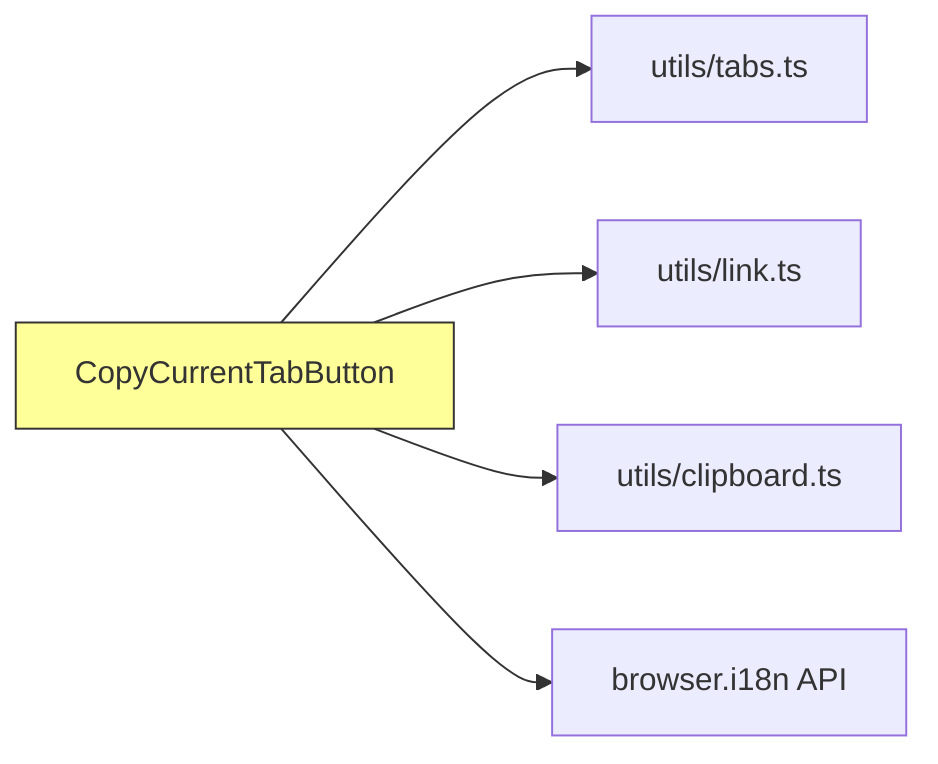

**処理フロー:**
```
クリック
  ↓
getCurrentTab() ← utils/tabs.ts
  ↓
createLinkForTab() ← utils/link.ts
  ↓
writeTextToClipboard() ← utils/clipboard.ts
  ↓
onCopied() callback
```

**依存先:**
- `utils/tabs.ts:getCurrentTab()` - アクティブタブ取得
- `utils/link.ts:createLinkForTab()` - リンク生成
- `utils/clipboard.ts:writeTextToClipboard()` - クリップボード書き込み
- `browser.i18n.getMessage()` - UI テキスト取得

**他のボタンコンポーネント:**
- `CopySelectedTabsButton.tsx` - `getSelectedTabs()` + `createLinksForTabs()` を使用
- `CopyAllTabsButton.tsx` - `getAllTabsOnCurrentWindow()` + `createLinksForTabs()` を使用

**共通パターン:** 全てのボタンが同じ依存関係構造とフローを持つ

---

#### 3-2. Side Panel コンポーネント

##### `sidepanel/main.tsx` (エントリポイント)

**役割:** Side Panel の React アプリケーションマウント

**依存関係:**
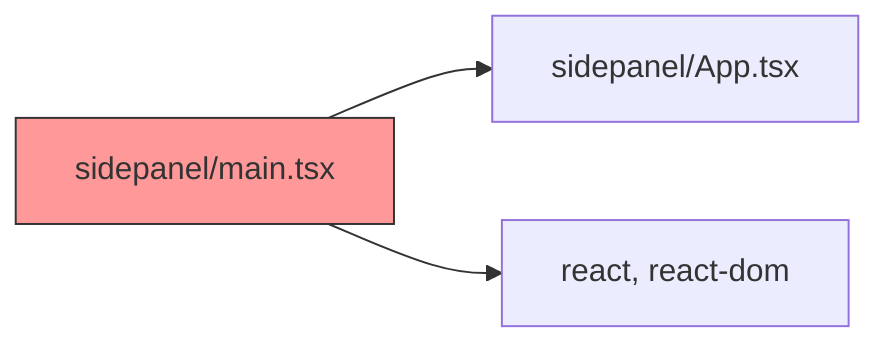

---

##### `sidepanel/App.tsx`

**役割:** クリップボードヒストリーの表示と再コピー

**依存関係:**
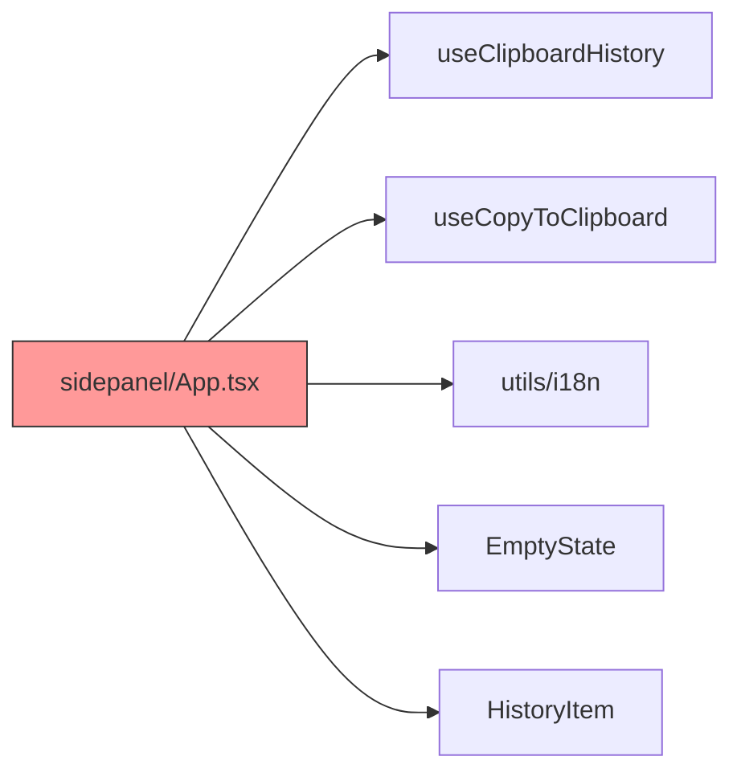

**依存先:**
- `hooks/useClipboardHistory` - ヒストリーデータ取得・監視
- `hooks/useCopyToClipboard` - 再コピー機能
- `utils/i18n` - i18n ヘルパー
- `components/EmptyState` - 空状態の表示
- `components/HistoryItem` - 各ヒストリーアイテムの表示

**レンダリングロジック:**
- `history.length === 0` → `EmptyState` 表示
- `history.length > 0` → `HistoryItem[]` をマップして表示

---

##### `sidepanel/hooks/useClipboardHistory.ts`

**役割:** ヒストリーデータの取得とリアルタイム更新

**依存関係:**
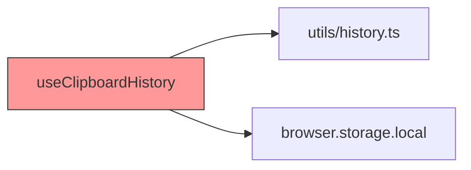

**依存先:**
- `utils/history.ts:getHistory()` - 初期データ取得
- `browser.storage.local.onChanged` - ストレージ変更の監視

**機能:**
- 初回マウント時にヒストリーをロード
- ストレージ変更を監視して自動更新
- クリーンアップでリスナー解除

---

##### `sidepanel/hooks/useCopyToClipboard.ts`

**役割:** ヒストリーアイテムの再コピー

**依存関係:**
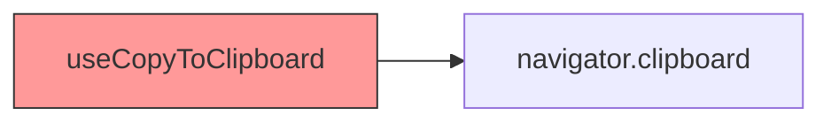

**依存先:**
- `navigator.clipboard.writeText()` - クリップボード書き込み

**注意:**
- `utils/clipboard.ts` を使用**しない**（ヒストリー二重登録を防ぐため）
- 一時的な視覚フィードバック（2秒間「Copied!」表示）

---

##### `sidepanel/utils/i18n.ts`

**役割:** i18n メッセージ取得のヘルパー

**依存関係:**
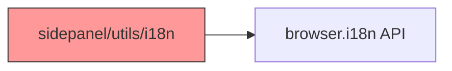

**機能:**
- `getMessage(key, fallback)` - メッセージ取得、見つからない場合は fallback を返す
- オーバーロード対応（substitutions 付き版もあり）

---

#### 3-3. Context Menu モジュール

##### `context_menu/handler_repository.ts`

**役割:** コンテキストメニューハンドラーの登録・管理（Repository パターン）

**依存関係:**
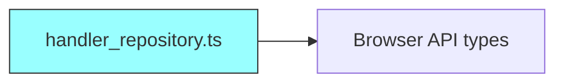

**クラス構造:**
```typescript
class HandlerRepository {
  private handlers: Record<string, HandlerInfo>

  registerHandler(handlerInfo: HandlerInfo): void
  getHandler(menuId: string): Handler | undefined
  getContextMenuInfo(): MenuInfo[]
}
```

**依存先:**
- `Browser.contextMenus.*` (型定義のみ)
- `Browser.tabs.Tab` (型定義のみ)

**使用箇所:**
- `context_menu/index.ts` - ハンドラー登録
- `background.ts` - ハンドラー実行

---

##### `context_menu/index.ts`

**役割:** コンテキストメニューハンドラーの実装と登録

**依存関係:**
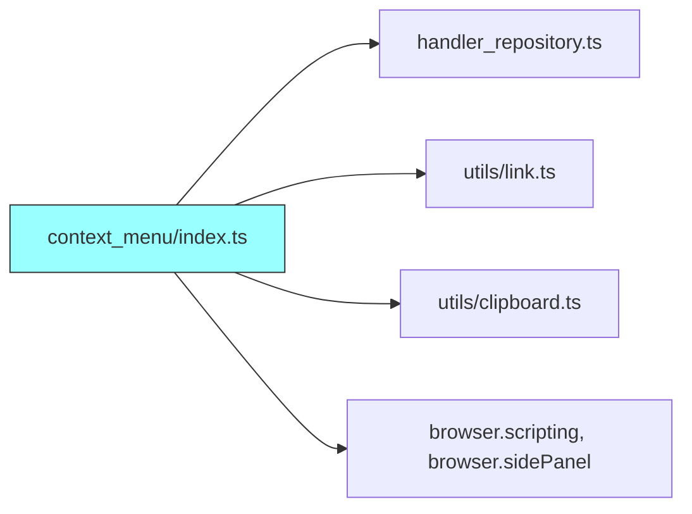

**登録ハンドラー:**

1. **`copy-for-scrapbox`** - ページリンクをコピー
   ```
   createLinkForTab(tab) → browser.scripting.executeScript({
     func: writeTextToClipboard,
     args: [text]
   })
   ```

2. **`copy-selection-as-quotation`** - 選択テキストを引用形式でコピー
   ```
   createLinkForTab(tab) → "> {selection}\n> {link}" 形式
   → browser.scripting.executeScript(...)
   ```

3. **`open-clipboard-history`** - サイドパネルを開く
   ```
   browser.sidePanel.open({ windowId })
   ```

**依存先:**
- `handler_repository.ts` - Repository インスタンス
- `utils/link.ts:createLinkForTab()` - リンク生成
- `utils/clipboard.ts:writeTextToClipboard` - スクリプト注入で実行
- `browser.scripting.executeScript()` - スクリプト注入
- `browser.sidePanel.open()` - サイドパネル表示

**スクリプト注入の理由:**
- Background script から直接 `navigator.clipboard` にアクセスできない
- ページコンテキストで `writeTextToClipboard` を実行する必要がある

---

#### 3-4. Background Script

##### `background.ts`

**役割:** Service Worker としてコンテキストメニューを初期化・ハンドリング

**依存関係:**
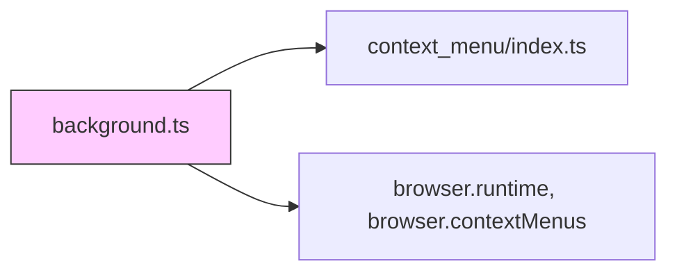

**処理フロー:**

1. **インストール時:**
   ```
   browser.runtime.onInstalled
     ↓
   contextMenuRepository.getContextMenuInfo()
     ↓
   browser.contextMenus.create() × N
   ```

2. **メニュークリック時:**
   ```
   browser.contextMenus.onClicked
     ↓
   contextMenuRepository.getHandler(menuItemId)
     ↓
   handler(info, tab)
   ```

**依存先:**
- `context_menu/index.ts` (default export: `repository`)
- `browser.runtime.onInstalled` - インストールイベント
- `browser.contextMenus.*` - メニュー API
- `browser.i18n.getMessage()` - i18n メッセージ展開

---

## 依存関係の特徴

### 依存方向の一貫性

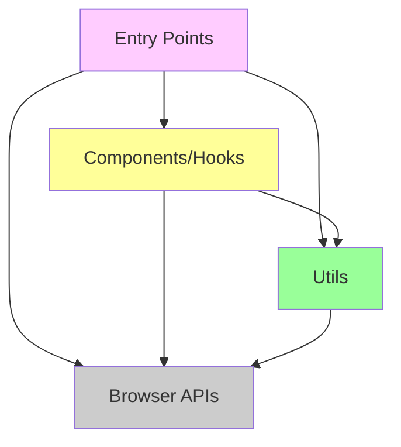

**原則:**
- ✅ 上位レイヤーは下位レイヤーに依存可能
- ❌ 下位レイヤーは上位レイヤーに依存不可
- ✅ 同一レイヤー内の依存は許容（循環依存を避ける）

### 循環依存の回避

**現在の実装:** 循環依存は存在しません

**例: `clipboard.ts` と `history.ts`**
```
clipboard.ts → history.ts  ✅
history.ts → clipboard.ts  ❌ (存在しない)
```

### 純粋関数の分離

**`utils/link.ts` の特徴:**
- 他のモジュールに一切依存しない
- ブラウザ API にも依存しない
- 完全に純粋な関数として実装
- **利点:**
  - テストが容易（モック不要）
  - 再利用性が高い
  - 理解しやすい

### 責任の分離

| モジュール | 責任 | 依存範囲 |
|----------|------|---------|
| `link.ts` | リンク生成ロジック | なし |
| `tabs.ts` | タブクエリ抽象化 | `browser.tabs` のみ |
| `clipboard.ts` | クリップボード操作統合 | `navigator.clipboard`, `history.ts` |
| `history.ts` | ヒストリー永続化 | `browser.storage` のみ |
| Components | UI とイベント処理 | Utils + Browser APIs |
| Entry Points | アプリケーション初期化 | Components + Utils |

---

## データフローの例

### 例1: ポップアップからタブをコピー

```mermaid
sequenceDiagram
    participant User
    participant Button as CopyCurrentTabButton
    participant Tabs as utils/tabs.ts
    participant Link as utils/link.ts
    participant Clip as utils/clipboard.ts
    participant Hist as utils/history.ts
    participant Storage as browser.storage

    User->>Button: クリック
    Button->>Tabs: getCurrentTab()
    Tabs->>Browser: browser.tabs.query()
    Browser-->>Tabs: [tab]
    Tabs-->>Button: [tab]
    Button->>Link: createLinkForTab(tab)
    Link-->>Button: "[URL Title]"
    Button->>Clip: writeTextToClipboard(text)
    Clip->>Navigator: navigator.clipboard.writeText(text)
    Clip->>Hist: addToHistory(text)
    Hist->>Storage: browser.storage.local.set()
    Clip-->>Button: 完了
    Button->>App: onCopied("Success")
```

### 例2: コンテキストメニューからコピー

```mermaid
sequenceDiagram
    participant User
    participant BG as background.ts
    participant Repo as handler_repository
    participant Handler as context_menu/index
    participant Link as utils/link.ts
    participant Page as Page Context

    User->>BG: 右クリック→メニュー選択
    BG->>Repo: getHandler(menuId)
    Repo-->>BG: handler function
    BG->>Handler: handler(info, tab)
    Handler->>Link: createLinkForTab(tab)
    Link-->>Handler: "[URL Title]"
    Handler->>Browser: scripting.executeScript({<br/>func: writeTextToClipboard,<br/>args: [text]<br/>})
    Browser->>Page: inject & execute
    Page->>Navigator: navigator.clipboard.writeText(text)
    Page->>Storage: browser.storage.local (history)
```

### 例3: サイドパネルでヒストリー表示

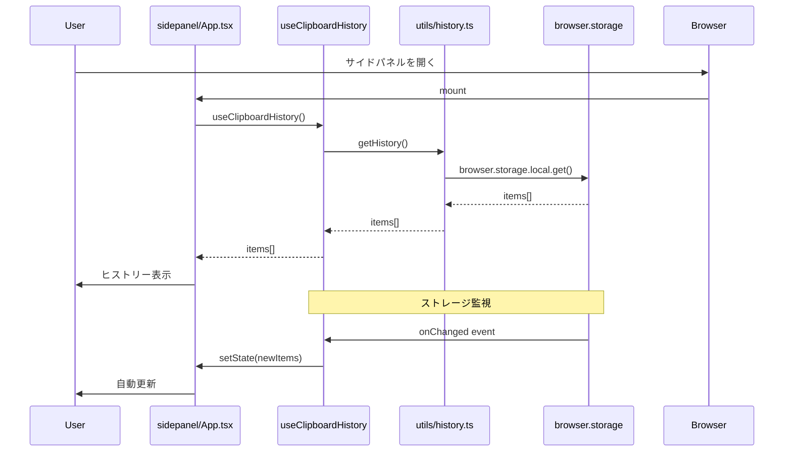

---

## 設計上の重要な判断

### 1. なぜ `clipboard.ts` は `history.ts` を呼ぶのか?

**理由:** クリップボード書き込みとヒストリー記録を常に同期させるため

**利点:**
- ヒストリー記録の呼び忘れを防ぐ
- クリップボード操作の一貫性を保証
- 呼び出し側のコードを簡潔に保つ

**例外:**
- `sidepanel/hooks/useCopyToClipboard.ts` は `navigator.clipboard` を直接使用
- 理由: ヒストリーからの再コピーなので、二重登録を避ける

### 2. なぜ `link.ts` は完全に独立しているのか?

**理由:**
- リンク生成ロジックはコアビジネスロジック
- 様々な場所から再利用される
- テストを容易にするため

**利点:**
- モック不要でユニットテスト可能
- ブラウザ環境なしでテスト実行可能
- 将来的な再利用が容易（例: Node.js スクリプトなど）

### 3. なぜコンテキストメニューはスクリプト注入を使うのか?

**制約:** Manifest V3 の Background Service Worker は `navigator.clipboard` にアクセスできない

**解決策:**
1. `writeTextToClipboard` 関数をページコンテキストに注入
2. ページコンテキストで実行
3. ページから `browser.storage` にアクセス可能（拡張機能権限を継承）

**代替案を採用しなかった理由:**
- ❌ Content Script 経由: メッセージングが複雑化
- ❌ Offscreen Document: オーバーヘッドが大きい
- ✅ スクリプト注入: シンプルで効率的

### 4. なぜ Repository パターンを使うのか?

**理由:**
- コンテキストメニューアイテムの管理を一元化
- ハンドラーの登録と実行を分離
- 新しいメニューアイテムの追加が容易

**構造:**
```
context_menu/index.ts (登録)
  ↓ export repository instance
background.ts (実行)
```

**利点:**
- 型安全性（TypeScript でハンドラーの型を保証）
- 拡張性（新しいハンドラーを `index.ts` に追加するだけ）
- テスタビリティ（ハンドラーを個別にテスト可能）

---

## テスト戦略と依存関係

### ユニットテストの依存関係

```mermaid
graph LR
    subgraph "Tests"
        LINK_TEST[link.test.js]
        TABS_TEST[tabs.test.js]
        HIST_TEST[history.test.ts]
    end

    subgraph "Source"
        LINK[link.ts]
        TABS[tabs.ts]
        HIST[history.ts]
    end

    subgraph "Mocks"
        BROWSER_MOCK[WxtVitest browser mocks]
    end

    LINK_TEST --> LINK
    TABS_TEST --> TABS
    TABS_TEST --> BROWSER_MOCK
    HIST_TEST --> HIST
    HIST_TEST --> BROWSER_MOCK

    style LINK_TEST fill:#afa
    style TABS_TEST fill:#afa
    style HIST_TEST fill:#afa
```

**テスト容易性の順:**
1. **`link.ts`** - 最も容易（依存なし、モック不要）
2. **`tabs.ts`, `history.ts`** - 中程度（Browser API モックが必要）
3. **Components** - 難（現在テストなし、複数の依存をモック必要）

---

## 将来的な改善案

### 依存関係の観点から

1. **Component のテスト追加**
   - 依存: Vitest + Testing Library
   - 利点: UI ロジックの品質保証

2. **Content Script の活用**
   - 現在: ほぼ未使用
   - 将来: ページ内 UI 要素の注入など
   - 依存: DOM 操作、メッセージング

3. **Options Page の追加**
   - 新規エントリポイント
   - 依存: `browser.storage.sync` (設定の同期)
   - 既存モジュールへの影響: 最小限

4. **Export/Import 機能**
   - 新規モジュール: `utils/export.ts`, `utils/import.ts`
   - 依存: `history.ts` (読み書き)
   - 利点: バックアップ・移行が容易

---

## まとめ

### 依存関係の健全性指標

| 指標 | 状態 | 説明 |
|-----|------|-----|
| **循環依存** | ✅ なし | 全てのモジュールが一方向依存 |
| **レイヤー分離** | ✅ 明確 | Entry Points → Components → Utils → Browser APIs |
| **純粋関数の分離** | ✅ 優秀 | `link.ts` は完全に独立 |
| **テスト容易性** | ⚠️ 中程度 | Utils は完璧、Components は未テスト |
| **再利用性** | ✅ 高い | Utils は複数箇所から利用可能 |

### アーキテクチャの強み

1. **明確な責任分離** - 各モジュールが単一の責任を持つ
2. **依存方向の一貫性** - 上位→下位の一方向のみ
3. **テスタビリティ** - Utils 層は完全にテスト可能
4. **拡張性** - 新機能追加時の影響範囲が明確

### 注意すべき点

1. **スクリプト注入の複雑さ** - コンテキストメニューからのクリップボードアクセス
2. **ヒストリー二重登録の防止** - `useCopyToClipboard` は `clipboard.ts` を使わない
3. **Browser API モック** - テスト時は WxtVitest が必須

---

**Document Version:** 2.0
**Last Updated:** 2026-01-12
**Codebase Version:** 1.11.0
