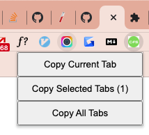
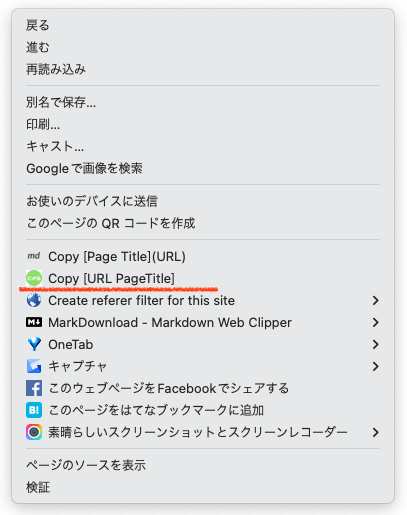
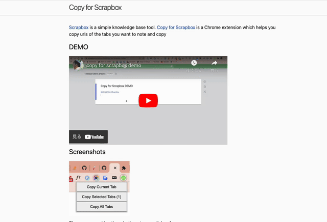

[Scrapbox](https://scrapbox.io) is a simple knowledge base tool.
[Copy for Scrapbox](https://chrome.google.com/webstore/detail/copy-for-scrapbox/kalhokahkhkmbkiliieonfdmdeajlnog) is a Chrome extension which helps you copy urls of the tabs you want to note and copy

## DEMO

<iframe width="560" height="315" src="https://www.youtube.com/embed/prKgvy8d9-c" title="YouTube video player" frameborder="0" allow="accelerometer; autoplay; clipboard-write; encrypted-media; gyroscope; picture-in-picture; web-share" allowfullscreen></iframe>

## Features

### Popup

The popup provides three buttons to copy links of:

- `Copy Current Tab`: the current tab
- `Copy Selected Tabs`: the selected tabs in the current window
- `Copy All Tabs`: all the tabs in the current window

### Context Menus

#### Copy Link to the current page

As shown in this screenshot, one context menu is provided for copying a link to the current tab.

#### Copy as Quote

This context menu copies selected text as quote in Scrapbox notation.

### Clipboard History

The extension automatically saves your clipboard history (up to 100 recent items) when you copy links using any of the extension's features. You can access your clipboard history through the context menu:

- Right-click on any webpage and select "Open Clipboard History"
- A side panel will open showing your recent copies with timestamps
- Click any history item to copy it back to your clipboard
- Visual "Copied!" feedback confirms successful copying
- History updates in real-time as you copy new items
- Timestamps show relative time (e.g., "5 minutes ago", "2 hours ago")

This feature makes it easy to:
- Retrieve recently copied links without re-copying them
- Keep track of your research and note-taking workflow
- Quickly access frequently used links from your history

## How to install

Visit [Chrome Web Store](https://chrome.google.com/webstore/detail/copy-for-scrapbox/kalhokahkhkmbkiliieonfdmdeajlnog) and click "Add to Chrome" button.

## Support and Contact

I'm welcoming your feedbacks and requests!
Please visit "Support" tab on Chrome Web Store. You can contact the publisher(it' me!).
If you have GitHub account, you can open [new ticket on GitHub](https://github.com/satoryu/copy-for-scrapbox/issues/new).

